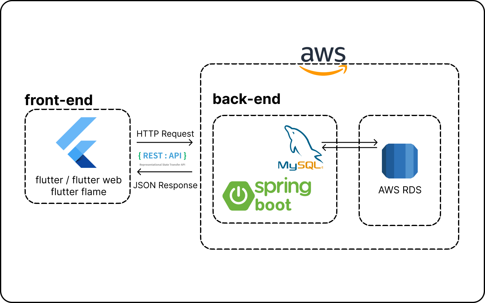
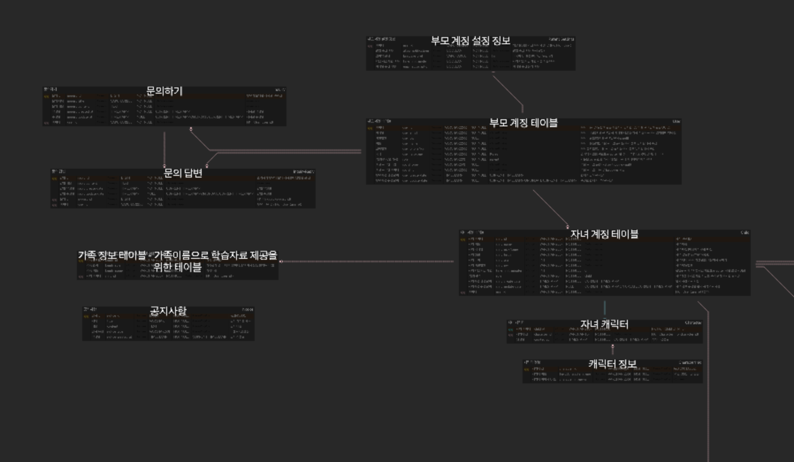
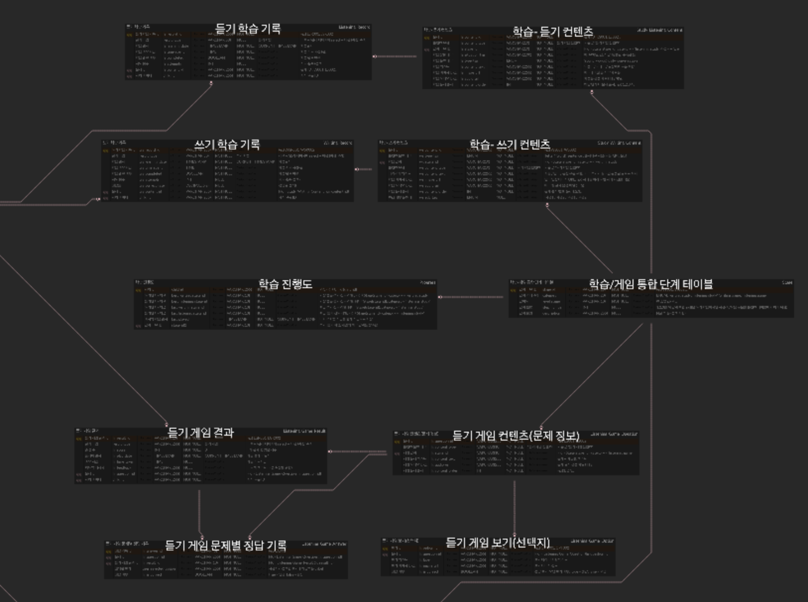
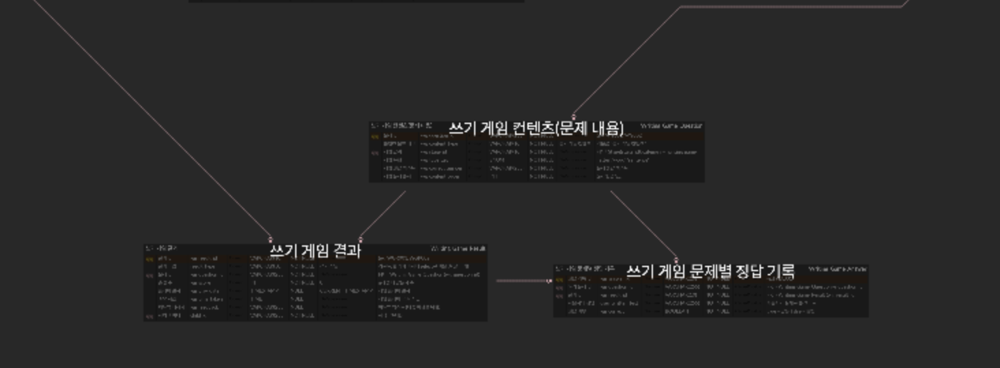

<p align="center">
  
</p>

<h1 align="center">📚 시나브로: 아이들의 마음에 스며드는 AI 한글 학습 </h1>
<p align="center"><i>“모르는 사이에 조금씩, 조금씩”</i></p>

---
[인실짐합 팀 PPT 보기!](https://github.com/insilzimhap/Sinabro-Frontend/1조_인실짐합_시나브로_-복사본.pdf)
---

## 🎬 시연 영상

<p align="center">
  <a href="https://youtu.be/KzE0-ie4p6A?si=d79fc-_oeu9bHrUl" target="_blank">
    <br>
    <b>👉 유튜브에서 시연 영상 보기</b>
  </a>
</p>

---

## 📝 프로젝트 소개

**시나브로**는 아이들이 자연스럽고 즐겁게 한글을 익힐 수 있도록,  
AI와 함께 학습, 게임, 그리고 따뜻한 상호작용을 담은 한국어 학습 플랫폼입니다.  
다문화 가정, 한글이 낯선 아이 누구나, 웃으며 성장할 수 있도록 만들었습니다.

---

## 🎨 기획 배경과 필요성

- **한글, 모두의 시작**  
  96%의 부모님이 초등 입학 전 한글 교육이 꼭 필요하다고 느낍니다.
- **다문화 가정의 어려움**  
  26.8%의 부모님이 자녀 한글 교육에 어려움을 겪고 있습니다.
- **기존 서비스의 한계**  
  반복적인 학습, 일방적인 콘텐츠로는 아이들의 흥미를 오래 지키기 어렵습니다.

<sub>자료: KOSIS 전국다문화가족실태조사(2021)</sub>

---

## 🎈 주요 기능

- **의성어・의태어로 배우는 한글**  
  일상생활 속 소리를 따라가며, 함께 한글을 익혀요.
- **AI 한글쓰기**  
  GPT와 Serlvy Pen SDK가 쓰기연습을 함께 해줍니다.
- **게임형 한글 놀이**  
  단어 맞추기, 받아쓰기 미니게임으로 한글을 즐겁게 배워요.

---

## 🧸 서비스 구성

| 서비스              | 설명                                                                |
|---------------------|---------------------------------------------------------------------|
| 의성어・의태어 학습  | 일상생활 속 의성어・의태어를 듣고, 쓰며 자연스럽게 아이가 학습할 수 있도록 도와줘요. |
| AI 받아쓰기         | 쓰기 인식과 실시간 피드백으로, 아이의 한글 실력을 차근차근 키워요.             |
| 게임형 학습         | 어휘, 문장, 음절 등 다양한 미니게임으로 자연스럽게 실력 업!                   |

---

## 👨‍👩‍👧 부모님과 함께하는 성장

- **맞춤형 학습 관리**  
  아이의 학습 진행을 확인하고, 칭찬 스티커와 출석 체크로 동기부여를 해요.
- **콘텐츠 직접 제작**  
  우리 아이에게 꼭 맞는 학습 자료를 부모님이 직접 만들어 줄 수 있어요.

---

## 🛠️ 기술 스택

<div align="center">

| Frontend        | Backend      | Database | AI                        | Cloud |
|-----------------|-------------|----------|---------------------------|-------|
| HTML, Flutter   | Spring Boot | MySQL    | GPT, Serlvy Pen SDK       | AWS RDS |

</div>

---

## 📂 폴더 구조

```
📦 lib/
 ┣ 📂main/
 ┃ ┣ 📂auth/              # 🔐 로그인/회원가입 관련 (자녀/부모)
 ┃ ┣ 📂childView/         # 🧒 자녀 전용 화면
 ┃ ┣ 📂gameView/          # 🎮 듣기/쓰기 게임 화면
 ┃ ┣ 📂mainView/          # 🏠 앱 시작 화면
 ┃ ┣ 📂parentView/        # 👨‍👩‍👧 부모 전용 화면
 ┃ ┗ 📂studyView/         # 📚 듣기/쓰기 학습 화면
 ┗ 📜main.dart            # 앱 시작점
 ```
---

## 📎 프로젝트 설계도

<p align="center">
  
</p>

---
## 🗂️ ERD 구조

<p align="center">
  
  
  
</p>

<p align="center">
  <sub>ERD 구조도: Sinabro의 데이터베이스 설계</sub>
</p>

---

## 📅 개발 일정

- **3~4월**: 프로젝트 기획, 역할 분담, 요구사항 분석
- **4~5월**: UI/DB 설계
- **5~8월**: 프론트엔드/백엔드 개발, 데이터베이스 구축, 연동
- **9~11월**: 오류 검증, 최종 문서 작성, 주간 회의 및 공유

---

## 🌷 기대 효과

1. **아이들의 자신감 성장**  
   한글이 어렵지 않다는 경험을 통해, 아이들이 스스로를 더 사랑하게 됩니다.
2. **부모님과의 소중한 추억**  
   함께 목소리를 녹음하고, 게임을 하며 가족의 유대가 깊어집니다.
3. **모두를 위한 한글 교육**  
   다양한 환경의 아이들이 차별 없이 한글을 배울 수 있습니다.

---

## 🤗 팀원

| 이름     | 역할             | 담당 업무         |
|----------|------------------|------------------|
| 김세란   | 팀장, 프론트엔드 | 프론트엔드 개발  |
| 문채영   | 백엔드           | 백엔드 개발      |
| 박성민   | 프론트엔드       | 프론트엔드 개발  |
| 심정화   | 백엔드           | 백엔드 개발      |
| 조연수   | 백엔드           | 백엔드 개발, 발표|

---

<p align="center"><b>시나브로와 함께, 아이들의 마음에 한글이 따뜻하게 스며듭니다.</b></p>

<p align="center">
  
</p>
