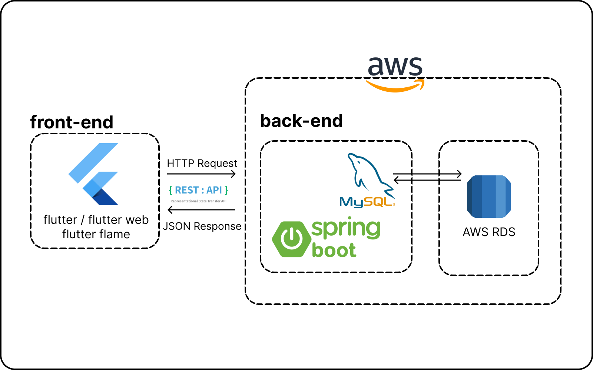
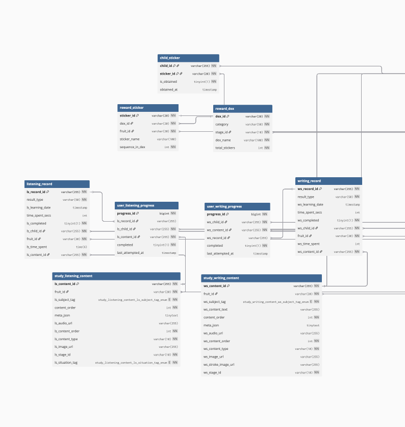
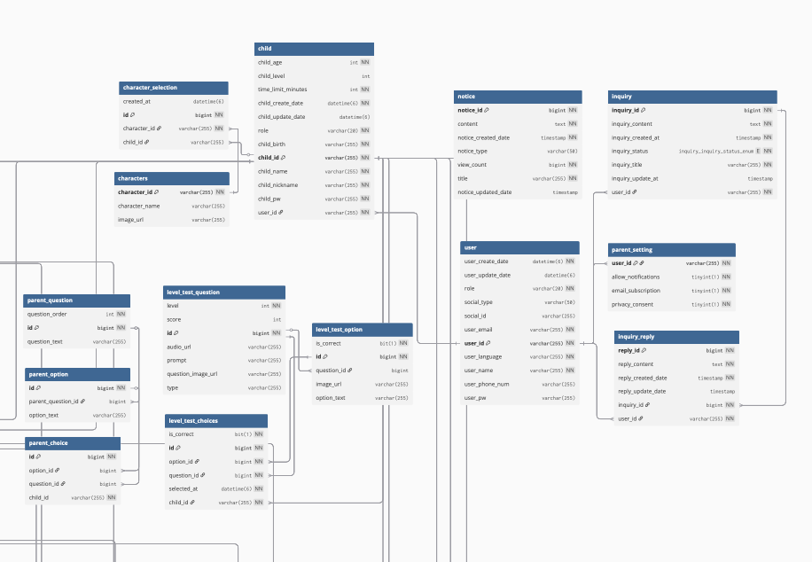
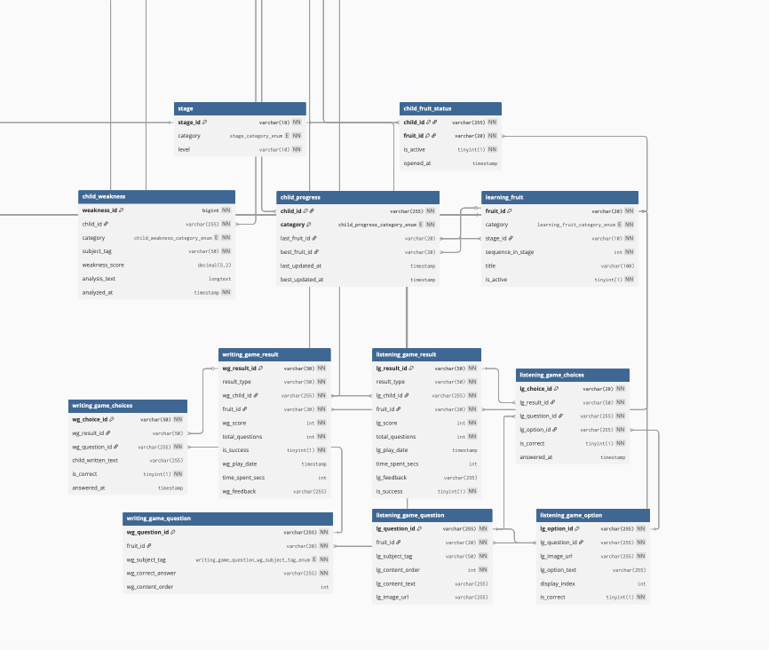

<p align="center">
  
</p>

<h1 align="center">📚 시나브로: 아이들의 마음에 스며드는 AI 한글 학습 </h1>
<p align="center"><i>“모르는 사이에 조금씩, 조금씩”</i></p>

---
[인실짐합 팀 PPT 보기!](1조_인실짐합_시나브로_-복사본.pdf)
---

## 🎬 시연 영상

<p align="center">
  <a href="https://youtu.be/KzE0-ie4p6A?si=d79fc-_oeu9bHrUl" target="_blank">
    <br>
    <b>👉 유튜브에서 시연 영상 보기</b>
  </a>
</p>

---

## 📝 프로젝트 소개
**시나브로**는 아이들이 AI와 함께 한글을 자연스럽고 즐겁게 배울 수 있도록 설계된
한국어 학습 플랫폼입니다.

딱딱한 교육이 아닌,
음성 인식, 이미지 생성, 게임 요소를 접목한 인터랙티브한 경험을 통해
아이들은 놀이처럼 한글에 익숙해지고,
부모는 아이의 성장을 따뜻하게 지켜볼 수 있습니다.

특히 다문화 가정이나 한글이 익숙하지 않은 아이들도
부담 없이 접근할 수 있도록 사용자 경험을 섬세하게 설계하였습니다.

시나브로는
AI 기술을 기반으로 한 실시간 상호작용, 진단형 학습,
감성적인 디자인과 피드백 시스템을 통해
아이 한 명 한 명의 속도에 맞춘 학습 여정을 함께합니다.

---

## 🎨 기획 배경과 필요성
다문화 가정의 지속적 증가
통계청에 따르면, 국내 다문화 가구 수는 매년 약 14,500가구씩 증가하고 있으며, 
2015년부터 2023년까지 9년간 38.9%가 증가했습니다. 이에 따라 다문화 가정 자녀의 수도 꾸준히 증가하고 있습니다. (출처: 통계청)

한글 교육의 필요성
여성가족부의 ‘전국 다문화가족 실태조사(2021)’에 따르면, 다문화 가정 부모 중 26.8%는 “자녀에게 한글을 직접 가르치기 어렵다”고 응답해, 한글 학습에 실질적인 어려움을 겪고 있는 것으로 나타났습니다. 
이는 유아기 자녀를 둔 가정일수록 더욱 두드러집니다.

AI 기반 학습 플랫폼의 필요성
다문화 가정 자녀들의 한글 학습 접근성과 흥미를 동시에 고려하여, 우리 팀은 AI 기술 기반의 학습 플랫폼을 기획했습니다. 
게임 요소와 학습 도우미 캐릭터를 활용하여 자연스럽고 즐거운 한글 학습 환경을 제공하고자 합니다.

---

## 🎈 주요 기능

### 👂 듣기 학습

- 의성어·의태어 학습: 소리(TTS)와 이미지 매칭

- 일상 회화 듣기: 상황 기반 문장 학습 + 음향 효과

- 음성은 Google TTS 활용, 자막 및 그림으로 보조

### ✍️ 쓰기 학습

- Selvy Pen SDK 활용 필기 인식 기능 탑재

- 자모음, 단어, 문장 단위 쓰기 → 실시간 채점

- 1회 오답 시 재도전, 2회 오답 시 다음 문제로 진행

- 정답 시 피드백 음성 + 칭찬 이미지 제공

### 🕹️ 게임형 학습 콘텐츠

- 듣기 게임: 소리 듣고 상황 카드 선택

- 쓰기 게임: 그림 보고 듣기 후 직접 쓰기

### 👪 부모 관리 기능
- 자녀 계정 생성 및 학습 현황 확인

- 학습 시간 설정, 콘텐츠 제한 기능

- 다국어 지원 UI (한국어 / 영어 등)

- 학습 리포트, 알림 및 공지사항 열람

---

## 🛠️ 기술 스택


- **Front-end**:  
- **Back-end**:  
- **Database**: 
- **AI**:  
- **Cloud**: 
- **디자인**: 
- **협업**: 


---

## 📂 폴더 구조

```
📦 lib/
 ┣ 📂main/
 ┃ ┣ 📂auth/              # 🔐 로그인/회원가입 관련 (자녀/부모)
 ┃ ┣ 📂childView/         # 🧒 자녀 전용 화면
 ┃ ┣ 📂gameView/          # 🎮 듣기/쓰기 게임 화면
 ┃ ┣ 📂mainView/          # 🏠 앱 시작 화면
 ┃ ┣ 📂parentView/        # 👨‍👩‍👧 부모 전용 화면
 ┃ ┗ 📂studyView/         # 📚 듣기/쓰기 학습 화면
 ┗ 📜main.dart            # 앱 시작점
 ```
---

## 📎 프로젝트 설계도

<p align="center">
  
</p>

---
## 🗂️ ERD 구조

<p align="center">
  
  
  
</p>

<p align="center">
  <sub>ERD 구조도: Sinabro의 데이터베이스 설계</sub>
</p>

---

## 📅 개발 일정

- **3~4월**: 프로젝트 기획, 역할 분담, 요구사항 분석
- **4~5월**: UI/DB 설계
- **5~8월**: 프론트엔드/백엔드 개발, 데이터베이스 구축, 연동
- **9~11월**: 오류 검증, 최종 문서 작성, 주간 회의 및 공유

---

## 🌷 기대 효과

- ### 아이들이 몰입하는 한글 학습
  실시간 애니메이션과 상호작용 기능을 통해, 아이들이 게임 속 환경에 자연스럽게 몰입하며 한글을 학습할 수 있습니다.

- ### 직관적인 조작으로 누구나 쉽게 학습
  간단한 터치와 드래그만으로 게임을 조작할 수 있어, 유아도 혼자서 쉽고 즐겁게 사용할 수 있습니다.

- ### 아이의 자신감과 정서 발달에 기여
  한글이 어렵지 않다는 긍정적인 경험을 통해, 아이 스스로에 대한 자신감이 자라고 학습에 대한 흥미와 동기도 함께 향상됩니다.


---

## 🤗 팀원

| 이름     | 역할             | 담당 업무         |
|----------|------------------|------------------|
| 김세란   | 팀장, 프론트엔드 | 프론트엔드 개발  |
| 문채영   | 백엔드           | 백엔드 개발      |
| 박성민   | 프론트엔드       | 프론트엔드 개발  |
| 심정화   | 백엔드           | 백엔드 개발      |
| 조연수   | 백엔드           | 백엔드 개발, 발표|

---


<p align="center">
  
</p>
