

  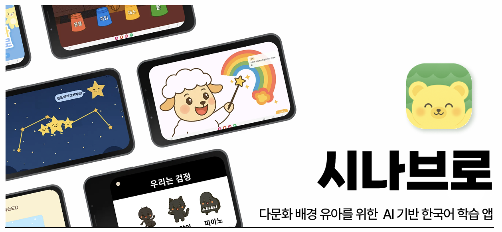

<h1 align="center">📚 시나브로: 아이들의 마음에 스며드는 AI 한글 학습</h1>

<i>“모르는 사이에 조금씩, 조금씩 자라는 우리 아이”</i>

---

## 🌱 1. 개발 배경

  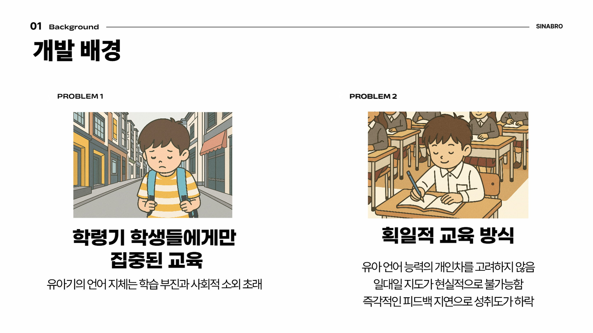

1. 유아기의 언어 지체는 학습 부진과 사회적 소외를 초래할 수 있으나, 기존 교육은 학령기에 집중되어 있습니다.

2. 즉각적인 피드백 부족, 개인차 반영 어려움 등으로 유아 학습 효과가 낮아지는 현실이 존재합니다.

---

## 🧒 2. 레벨 테스트

  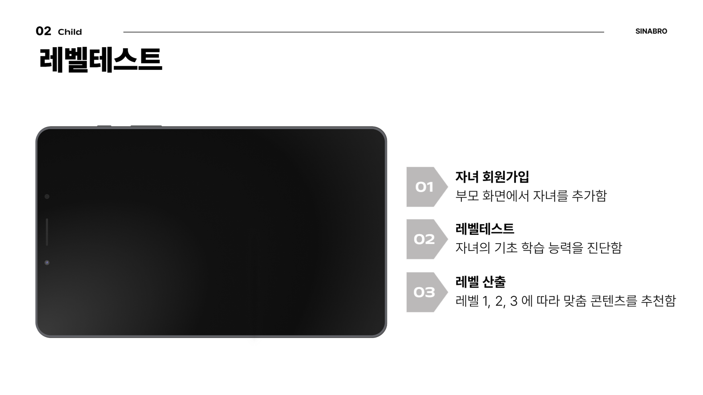

   
---

## 🎧 3. 학습 & 게임 기능

### 🎧 3-1. 듣기 학습

  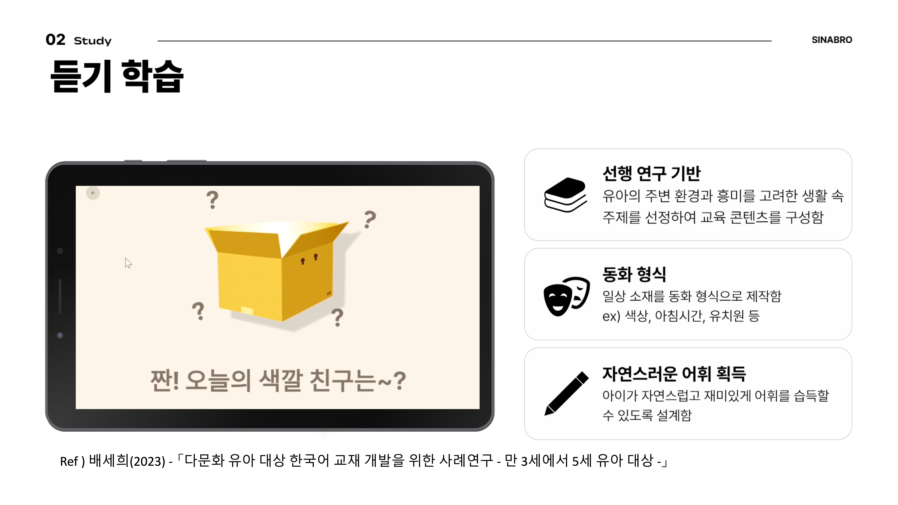

- 선행 연구 기반 생활형 콘텐츠  
- 동화 형식 구성  
- 자연스러운 어휘 습득 유도

### ✏️ 3-2. 쓰기 학습

  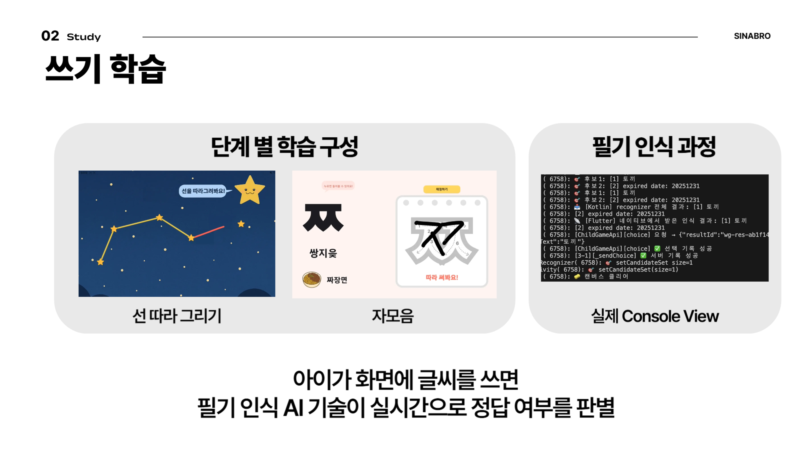

- 필기 인식 AI 기술이 실시간으로 정답 여부 판별
  
---

### 🎮 3-3. 듣기 게임

  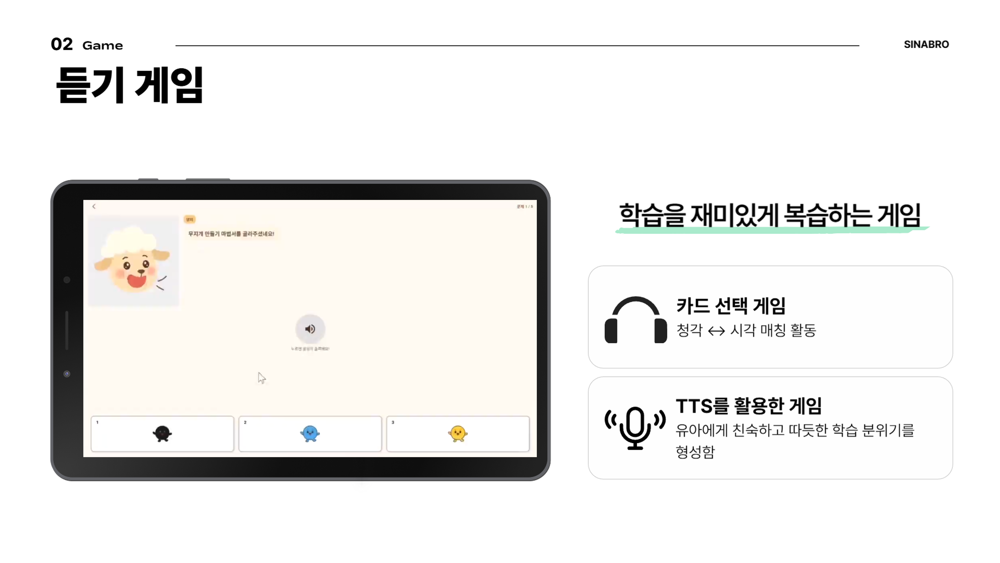

- 청각 ↔ 시각 매칭 카드 선택 게임  
- TTS로 친숙한 학습 분위기 제공

### 🎮 3-4. 쓰기 게임

  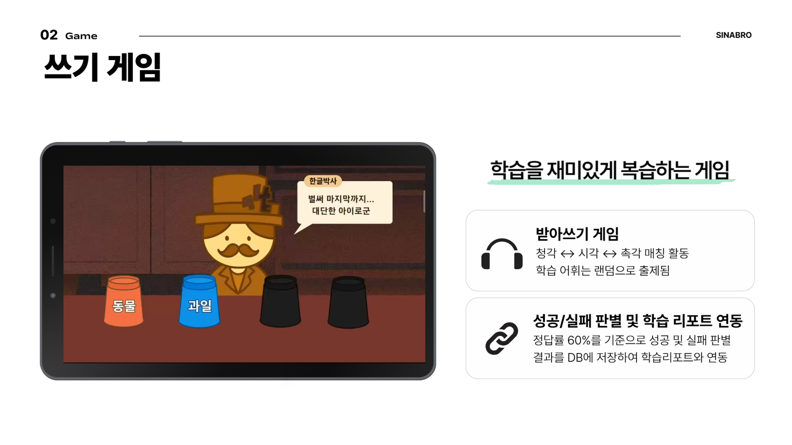

- 청각 ↔ 시각 ↔ 촉각매칭 활동
- 성공/실패 판별 및 학습 리포트 연동

---

### ⭐ 3-5. 보상 및 도감 시스템

  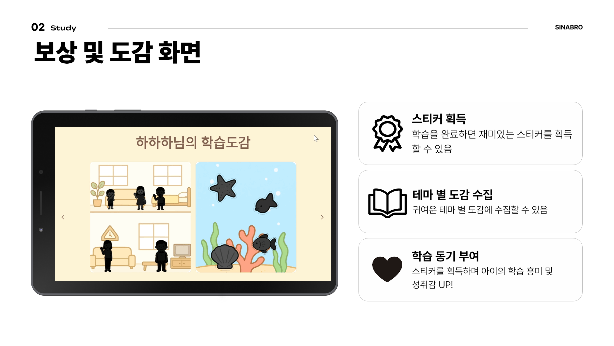

- 스티커 획득  
- 테마별 도감 수집  
- 학습 동기 강화  

---

## 👨‍👩‍👧 4. 부모 페이지

  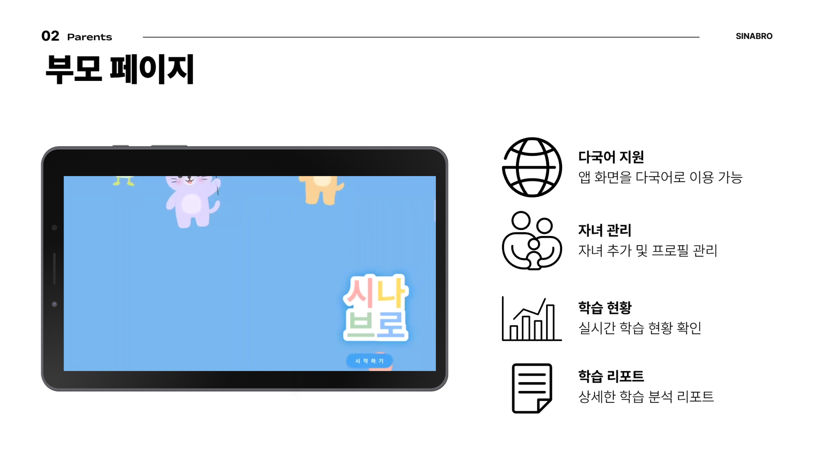

- 다국어 UI 지원  
- 자녀 관리  
- 학습 현황 실시간 조회  
- AI 기반 상세 리포트 제공

---

## AI 기술 (GPT / Translate / Pen SDK)

### 🤖 1. GPT-4o-mini: AI 학습 리포트

  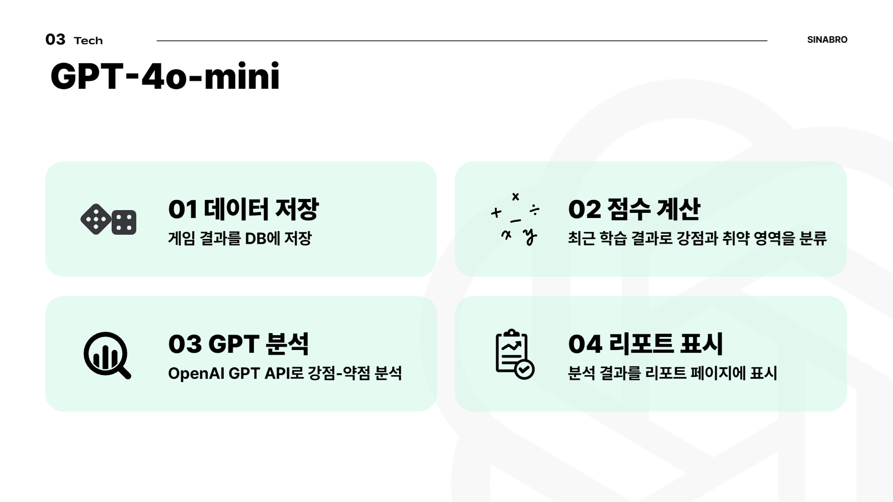

#### 1-1.부모 화면 

  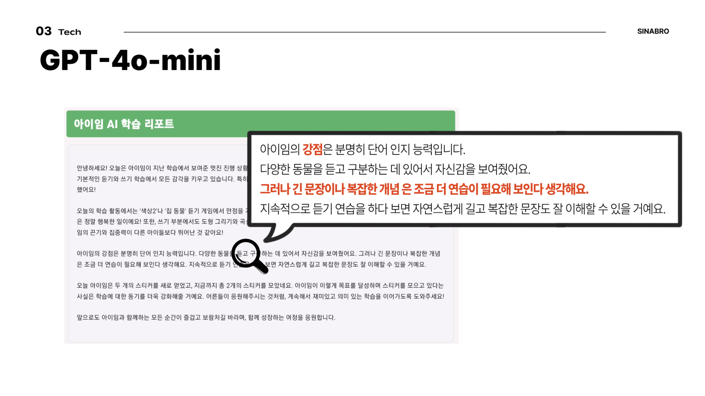

---

### 🌍 2. Google Translate API

  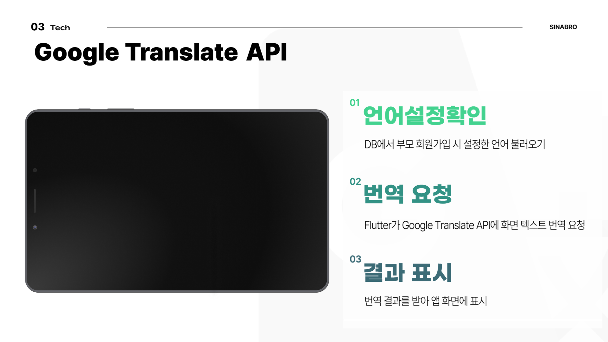

- 보호자 언어 설정 기반 자동 번역  
- 학습 화면 및 리포트 다국어 표시  

---

### ✍️ 3. Selvy Pen SDK

  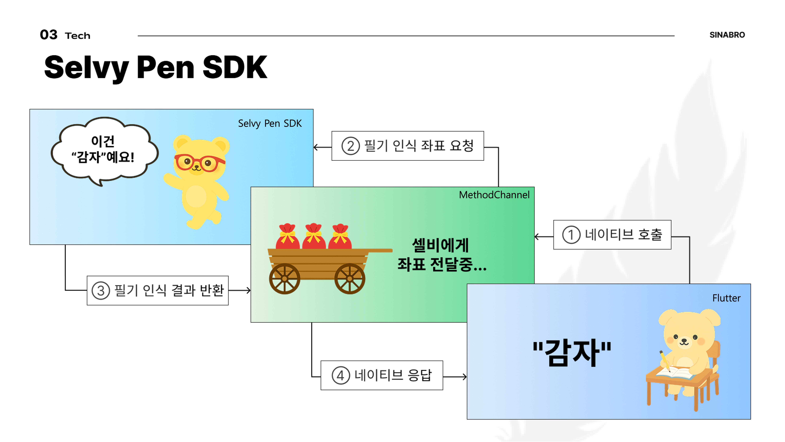

- 필기 스트로크 기반 인식  
- Native(Android)에서 인식 → Flutter로 전달  
- 실시간 성공/실패 판단

---

## Architecture

  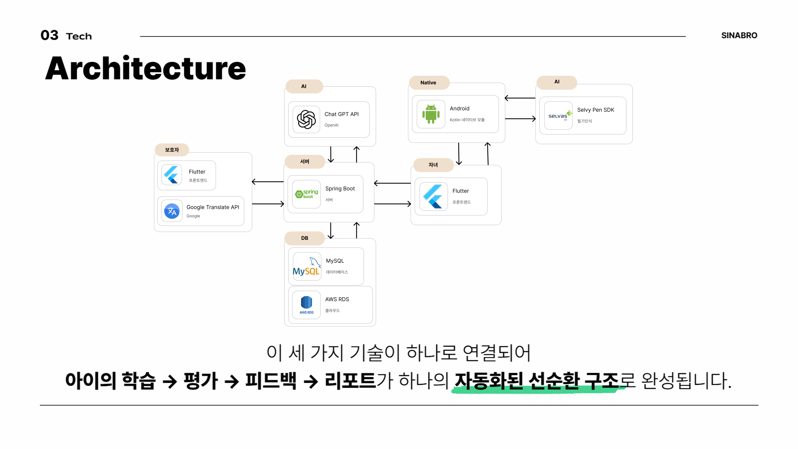

세 가지 기술(GPT · Translate · Pen SDK)을 연결하여  
**아이 학습 → 평가 → 피드백 → AI 리포트**  
이 모두 자동화된 선순환 구조 완성.

---

## ERD

  

---

# 🛠 기술 스택

### **Frontend**

  
  
  

### **Backend**

  
  

### **AI**

  
  

### **Infra**

  

### **Other**

  
  
  

---

# 📄 프로젝트 문서

- 🎞 **최종 발표 PPT**  
  👉 [최종발표_PPT](./시나브로_최종본.pdf)

- 🎨 **Figma**  
  👉 [인실짐합 Figma 바로가기](https://www.figma.com/design/X243XO41NYDwC0B6wtYjln/%EC%9D%B8%EC%8B%A4%EC%A7%90%ED%95%A9-%EC%B5%9C%EC%A2%85?node-id=155-23&p=f)

- 📘 **포스터**  
  👉 [2025_컴퓨터소프트웨어공학과_경진대회_포스터](sinabro/assets/file/2025_경진대회_포스터발표양식_인실짐합_컴퓨터소프트웨어공학과.pdf)

- 📘 **졸업 논문**  
  👉 [논문 다운로드](https://YOUR_LINK_HERE)

---

